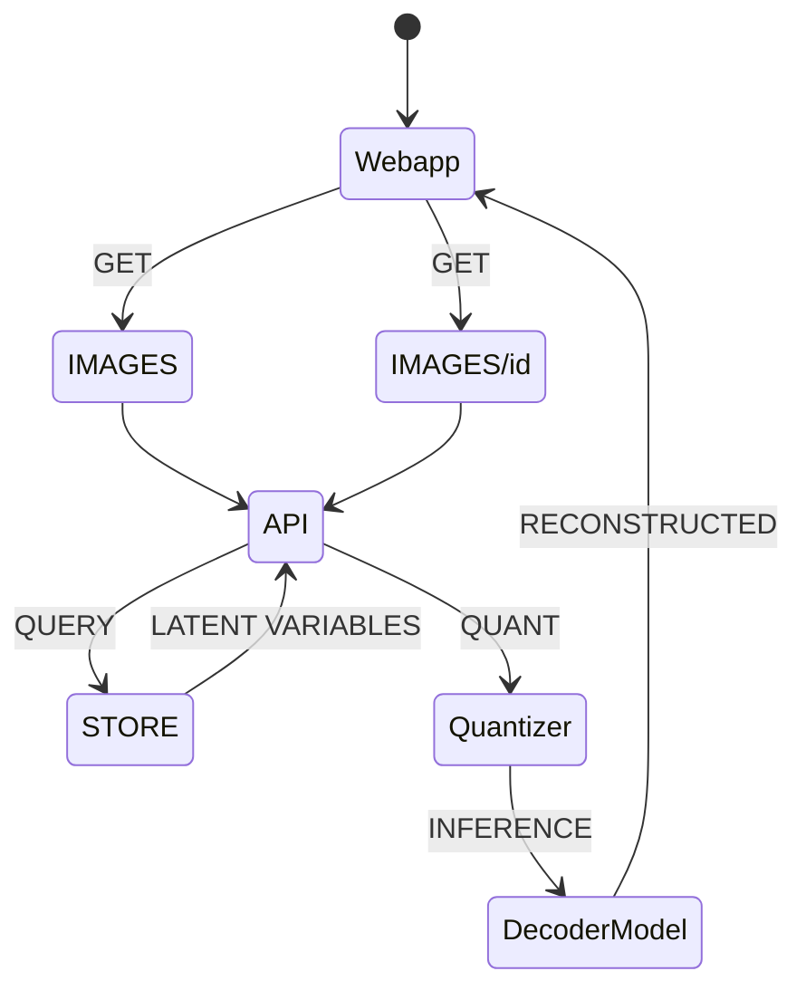

# Image Compressor project

<p align='center'>
  
</p>

[EXPERIMENTAL]

This repo consist of an Image Compressor system using pretrained Vector Quantized Variational Autoencoder (VQVAE) developed with Tensorflow (see notebooks dir) and hosted within the framework of FASTapi (see app dir).

**Tech**
- VQVAE
- VAE Tiny

## 🚀 Prerequisite
- install [miniforge](https://github.com/conda-forge/miniforge)
- create virtual env || conda
- initialize SQLlite || [Qdrant](https://qdrant.tech)
- from root enter the following command line
```commandline
pip install -r requirements.txt
```
```commandline
pip install python-dotenv
```

### **WINDOWS** for CUDA Deep Neural Network
- tensorflow
```commandline 
conda install -c conda-forge cudatoolkit=11.2 cudnn=8.1.0
```

```commandline 
pip install tensorflow==2.10
```

- [pytorch](https://pytorch.org/get-started)
```
pip install torch torchvision torchaudio --index-url https://download.pytorch.org/whl/cu121
```

### **MACOS** for MPS
- tensorflow [installer](https://developer.apple.com/metal/tensorflow-plugin/) for MPS
```commandline 
conda install -c apple tensorflow-deps
```

```commandline
pip install tensorflow-macos==2.10.0 tensorflow-metal==0.6.0
```

- [pytorch](https://pytorch.org/get-started)
```commandline 
pip install torch torchvision
```

### **TODO**
- app
```commandline
python app/main.py
```
- test
```commandline
pytest
```

## 📖 DOCS
- http://127.0.0.1:8000/docs

## ARCHITECTURE


# !!Credits
- [madebyollin](https://github.com/madebyollin)
- 🤗 [Hugging Face](https://github.com/huggingface)