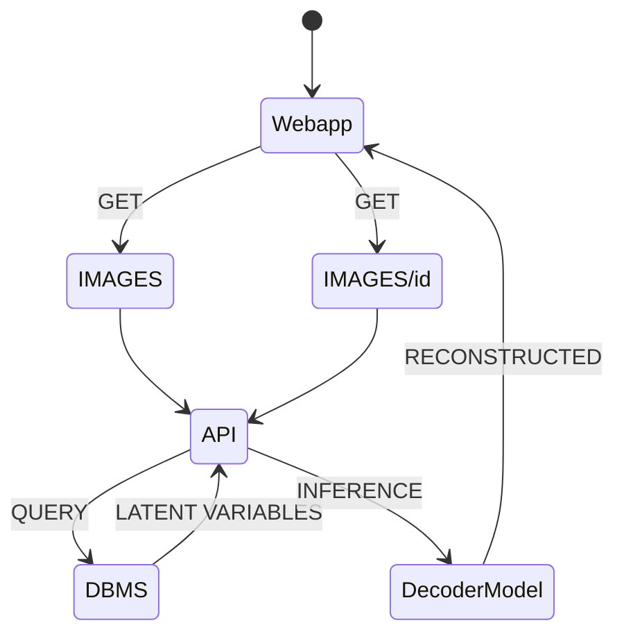

# Image Compressor project
This repo consist of an Image Compressor system using AutoEncoder Neural Net developed with Tensorflow and hosted within the framework of FASTapi.

## Prerequisite
- install miniforge
- create virtual env
- initialize SQLlite data source
- from root enter the following command line
  - ```pip install -r requirements.txt```
- tensorflow [installer](https://developer.apple.com/metal/tensorflow-plugin/) for MPS
  - conda install -c apple tensorflow-deps
  - pip install tensorflow-macos==2.10.0 tensorflow-metal==0.6.0
- run application
  - main.py
- run test
  - pytest

## DOCS
- http://127.0.0.1:8000/docs

## ARCHITECTURE
