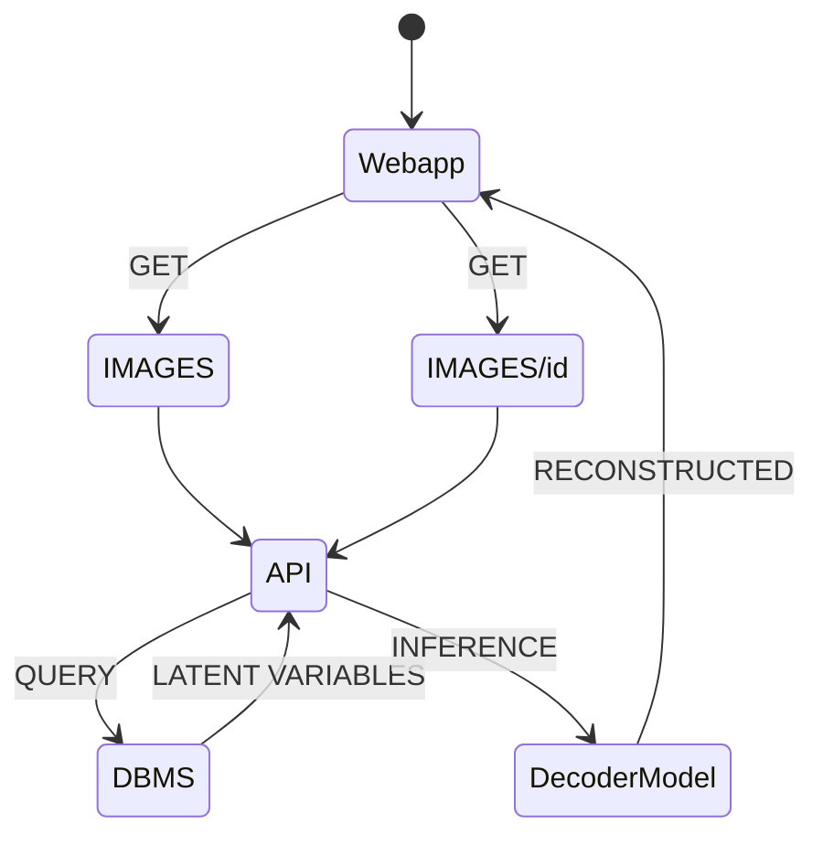

# Image Compressor project
This repo consist of an Image Compressor system using pretrained Vector Quantized Variational Autoencoder (VQVAE) developed with Tensorflow (see notebooks dir) and hosted within the framework of FASTapi (see app dir).

## Prerequisite
- install miniforge
- create virtual env
- initialize SQLlite data source
- from root enter the following command line
```commandline
 pip install -r requirements.txt
```

- **WINDOWS** for CUDA Deep Neural Network
```commandline 
conda install -c conda-forge cudatoolkit=11.2 cudnn=8.1.0
pip install tensorflow==2.10
```

- **MACOS** for MPS
  - tensorflow [installer](https://developer.apple.com/metal/tensorflow-plugin/) for MPS
```commandline 
conda install -c apple tensorflow-deps
pip install tensorflow-macos==2.10.0 tensorflow-metal==0.6.0
```

- run application
```commandline
python app/main.py
```
- run test
```commandline
pytest
```

## DOCS
- http://127.0.0.1:8000/docs

## ARCHITECTURE
